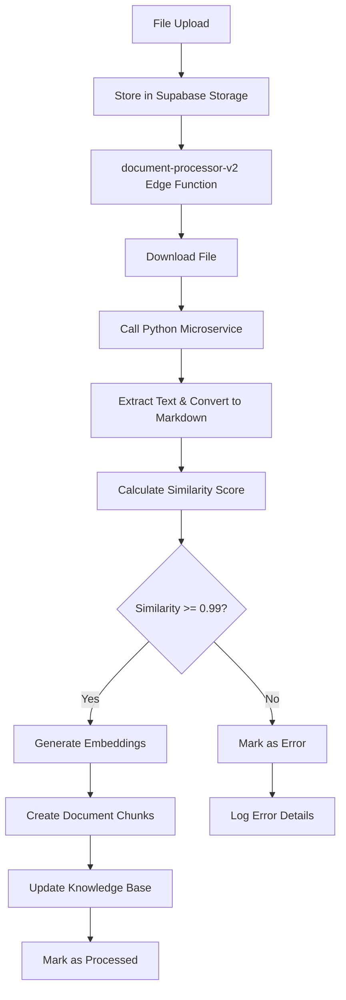

# Knowledge Base Universal Pipeline Documentation

## Overview

The Knowledge Base Universal Pipeline is a comprehensive document processing system that supports multiple file formats with high-fidelity content extraction and semantic search capabilities.

## Supported Formats

- **PDF**: Using `pdfplumber` for text extraction
- **DOCX**: Using `python-docx` for Microsoft Word documents
- **PPTX**: Using `python-pptx` for PowerPoint presentations
- **RTF**: Using `textract` for Rich Text Format
- **TXT**: Direct text reading with encoding detection
- **HTML**: Using `BeautifulSoup` for HTML parsing
- **EPUB**: Using `ebooklib` for e-books
- **Images (PNG/JPG)**: Using `pytesseract` OCR for text extraction

## Architecture

### Components

1. **Python Microservice** (`document-extract-service`)
   - FastAPI-based service for document text extraction
   - Converts extracted text to structured Markdown
   - Deployed as a containerized service

2. **Edge Function** (`document-processor-v2`)
   - Orchestrates the complete processing pipeline
   - Handles file download, extraction, validation, and storage
   - Manages similarity validation and embedding generation

3. **Database Schema**
   - Extended `knowledge_base` table with new metadata columns
   - `document_chunks` table for storing text embeddings
   - `pipeline_settings` for configuration management

4. **Admin Interface**
   - Upload interface supporting all formats
   - Real-time processing status and metrics
   - Reprocessing and management capabilities

### Processing Flow



## Configuration

### Pipeline Settings

The pipeline is controlled via the `pipeline_settings` table:

| Setting Key | Description | Default |
|-------------|-------------|---------|
| `USE_UNIVERSAL_PIPELINE` | Enable/disable universal pipeline | `false` |
| `SIMILARITY_THRESHOLD` | Minimum similarity score for approval | `0.99` |
| `EXTRACTOR_SERVICE_URL` | URL of the Python microservice | Required |
| `MAX_CHUNK_SIZE` | Maximum size of text chunks | `1000` |
| `CHUNK_OVERLAP` | Overlap between chunks | `200` |

### Environment Variables

**Required for Edge Function:**
- `SUPABASE_URL`: Supabase project URL
- `SUPABASE_SERVICE_ROLE_KEY`: Service role key for database access
- `GEMINI_API_KEY`: Google Gemini API key for embeddings

**Required for Python Microservice:**
- `EXTRACTOR_SERVICE_URL`: Public URL where the service is accessible

## Database Schema

### knowledge_base Table Extensions

```sql
-- New columns added for universal pipeline
ALTER TABLE knowledge_base ADD COLUMN mime_type TEXT;
ALTER TABLE knowledge_base ADD COLUMN extraction_method TEXT;
ALTER TABLE knowledge_base ADD COLUMN ocr_used BOOLEAN DEFAULT FALSE;
ALTER TABLE knowledge_base ADD COLUMN similarity_score NUMERIC;
ALTER TABLE knowledge_base ADD COLUMN markdown_content TEXT;
```

### document_chunks Table

```sql
CREATE TABLE document_chunks (
  id UUID PRIMARY KEY DEFAULT gen_random_uuid(),
  knowledge_base_id UUID REFERENCES knowledge_base(id),
  content TEXT NOT NULL,
  embedding vector,
  chunk_index INTEGER NOT NULL,
  chunk_size INTEGER NOT NULL,
  metadata JSONB DEFAULT '{}',
  created_at TIMESTAMPTZ DEFAULT now()
);
```

## API Endpoints

### Python Microservice

**Base URL**: `{EXTRACTOR_SERVICE_URL}`

#### POST /extract
Extracts text from uploaded document and converts to Markdown.

**Request:**
```http
POST /extract
Content-Type: multipart/form-data

file: [binary file data]
```

**Response:**
```json
{
  "success": true,
  "original_text": "Raw extracted text...",
  "markdown": "# Converted Markdown...",
  "extraction_method": "pdfplumber",
  "mime_type": "application/pdf",
  "ocr_used": false,
  "similarity": 0.98,
  "processing_time_ms": 1250
}
```

#### GET /health
Health check endpoint.

**Response:**
```json
{
  "status": "healthy",
  "service": "document-extract-service",
  "version": "1.0.0",
  "timestamp": "2024-01-01T00:00:00Z",
  "extractors": ["pdf", "docx", "pptx", "rtf", "txt", "html", "epub", "image"]
}
```

### Edge Function

#### POST /document-processor-v2
Processes a document through the complete pipeline.

**Request:**
```json
{
  "fileId": "uuid-of-knowledge-base-entry"
}
```

**Response:**
```json
{
  "success": true,
  "message": "Document processed successfully",
  "fileId": "uuid-of-knowledge-base-entry",
  "similarity": 0.99,
  "chunksCreated": 5
}
```

## Quality Validation

### Similarity Calculation

The pipeline uses a hybrid approach to calculate similarity between original and processed text:

1. **Levenshtein Distance**: Character-level comparison
2. **Embedding Similarity**: Semantic comparison using Gemini embeddings
3. **Combined Score**: Weighted average of both metrics

### Approval Criteria

Documents are only approved for embedding generation if:
- Similarity score >= configured threshold (default: 0.99)
- Text extraction successful without critical errors
- Markdown conversion maintains content structure

## Error Handling

### Processing Errors

| Error Type | Status | Action |
|------------|--------|---------|
| File Download Failed | `error` | Logged, user notified |
| Extraction Failed | `error` | Logged, fallback to OCR if applicable |
| Low Similarity | `error` | Logged, document marked for review |
| Embedding Generation Failed | `error` | Logged, document marked as processed but incomplete |

### Logging Structure

```json
{
  "pipeline": "universal-v2",
  "stage": "EXTRACTION|VALIDATION|CHUNKING|EMBEDDINGS|COMPLETED|ERROR",
  "timestamp": "2024-01-01T00:00:00Z",
  "processing_time_ms": 1250,
  "similarity_score": 0.99,
  "extraction_method": "pdfplumber",
  "ocr_used": false,
  "chunks_created": 5,
  "error_message": "Optional error details"
}
```

## Testing

### Automated Test Suite

Run the comprehensive test suite:

```bash
# Install dependencies
npm install

# Run universal pipeline tests
npm run test:universal-pipeline
```

The test suite validates:
- File upload for all supported formats
- Complete pipeline processing
- Similarity validation
- Embedding generation
- Database integrity

### Manual Testing

1. **Upload Test Files**: Use the admin interface to upload sample files
2. **Monitor Processing**: Check processing status and logs
3. **Validate Output**: Verify similarity scores and markdown content
4. **Test Search**: Perform semantic searches to validate embeddings

## Migration Guide

### From Legacy Pipeline

1. **Set Pipeline Flag**: Update `USE_UNIVERSAL_PIPELINE` to `true`
2. **Run Migration Script**: Execute the legacy data migration
3. **Validate Results**: Verify migrated documents have proper metadata
4. **Monitor Performance**: Check processing times and success rates

```bash
# Run migration script
ts-node scripts/migrate-legacy-kb-to-universal.ts
```

### Rollback Procedure

If issues occur:
1. Set `USE_UNIVERSAL_PIPELINE` to `false`
2. Legacy pipeline will resume handling new uploads
3. Investigate issues with universal pipeline
4. Fix and re-enable when ready

## Performance Considerations

### Optimization Tips

1. **Batch Processing**: Process multiple files in parallel
2. **Chunk Size Tuning**: Adjust based on embedding model limits
3. **Similarity Threshold**: Balance quality vs. acceptance rate
4. **Caching**: Cache embeddings for reprocessed documents

### Monitoring Metrics

- Processing success rate by file type
- Average processing time per format
- Similarity score distribution
- Embedding generation success rate
- Storage usage for chunks and embeddings

## Security

### Access Control

- All operations require admin role verification
- File access limited to authorized users
- API keys stored securely in environment variables
- Row-level security enforced on all tables

### Data Protection

- Files encrypted in Supabase Storage
- Text content stored with appropriate access controls
- Embedding vectors don't contain sensitive information
- Processing logs exclude file content

## Troubleshooting

### Common Issues

1. **Low Similarity Scores**
   - Check document quality and format
   - Review extraction method used
   - Consider OCR for scanned documents

2. **Processing Failures**
   - Verify microservice accessibility
   - Check environment variables
   - Review processing logs

3. **Missing Embeddings**
   - Verify Gemini API key
   - Check API rate limits
   - Review chunk generation logs

### Debug Mode

Enable detailed logging by setting processing flags in admin interface.

## Future Enhancements

- Support for additional file formats
- Custom extraction models for specialized documents
- Real-time processing status updates
- Batch upload capabilities
- Advanced similarity algorithms
- Multi-language content support

## Support

For technical support or questions:
- Check processing logs in admin interface
- Review this documentation
- Contact system administrators